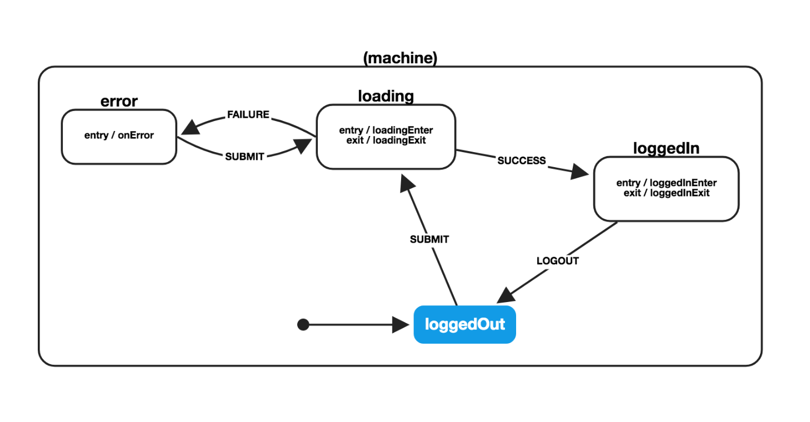

# React Automata Example

Basic react-automata-based implementation of the xstate-based login example here
https://css-tricks.com/finite-state-machines-with-react/

Features 
- Redux Dev Tools integration
- testStateMachine for automagical snapshotting

Chart built with
[xviz](https://musing-rosalind-2ce8e7.netlify.com/?machine=%7B%22initial%22%3A%22loggedOut%22%2C%22states%22%3A%7B%22loggedOut%22%3A%7B%22on%22%3A%7B%22SUBMIT%22%3A%22loading%22%7D%7D%2C%22loading%22%3A%7B%22onEntry%22%3A%5B%22loadingEnter%22%5D%2C%22onExit%22%3A%5B%22loadingExit%22%5D%2C%22on%22%3A%7B%22SUCCESS%22%3A%22loggedIn%22%2C%22FAILURE%22%3A%22error%22%7D%7D%2C%22loggedIn%22%3A%7B%22onEntry%22%3A%5B%22loggedInEnter%22%5D%2C%22onExit%22%3A%5B%22loggedInExit%22%5D%2C%22on%22%3A%7B%22LOGOUT%22%3A%22loggedOut%22%7D%7D%2C%22error%22%3A%7B%22onEntry%22%3A%5B%22onError%22%5D%2C%22on%22%3A%7B%22SUBMIT%22%3A%22loading%22%7D%7D%7D%7D)
